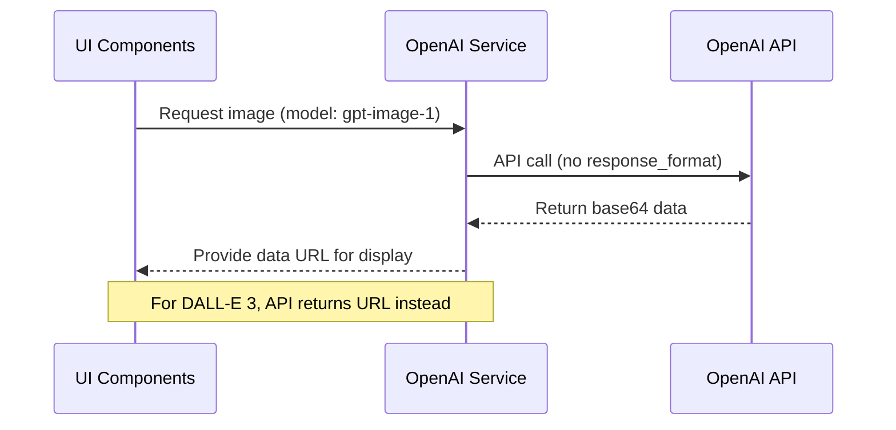

# GPT Image Documentation Update Plan

## Objective

Update the following documentation files to reflect the correct handling of the GPT-image-1 model, specifically:
- The GPT-image-1 model returns base64 data by default (no need for 'response_format').
- The correct way to handle both URL and base64 responses.
- Removal of any references to the 'response_format' parameter for GPT-image-1.

## 1. `image-generator-architecture.md`

### A. "OpenAI Integration" Section
- Add a subsection or note explaining:
  - The GPT-image-1 model returns base64-encoded image data by default.
  - The 'response_format' parameter is not needed or supported for GPT-image-1.
  - The application must handle base64 data directly for this model.

### B. "Provider Abstraction Layer" and Example Implementation
- Update the example OpenAI service implementation:
  - Remove or comment out any use of `response_format: "url"` for GPT-image-1.
  - Show how to handle the base64 response (e.g., converting to a data URL for display).
  - If supporting both URL and base64 models, show conditional handling.

### C. Add a Note or Table
- Summarize the difference between DALL-E 3 and GPT-image-1 in terms of response format and handling.

### D. (Optional) Update Data Flow Diagram
- If the diagram currently implies only URL handling, add a note or branch for base64 handling.

#### Example Table

| Model         | Response Format | 'response_format' Param | Handling Required      |
|---------------|----------------|------------------------|-----------------------|
| DALL-E 3      | URL            | Required               | Use image URL         |
| GPT-image-1   | base64         | Not needed/supported   | Convert base64 to URL |

#### Example Code Snippet

```typescript
if (model === "gpt-image-1") {
  // Response contains base64 data by default
  const base64 = response.data[0].b64_json;
  const imageUrl = `data:image/png;base64,${base64}`;
  // Use imageUrl in the UI
} else {
  // DALL-E 3 or other models
  const imageUrl = response.data[0].url;
}
```

#### Example Mermaid Diagram



---

## 2. `gpt-image-implementation-plan.md`

### A. "Update OpenAI Provider" Step
- Explicitly state that the GPT-image-1 model returns base64 data by default.
- Instruct to remove any use of the 'response_format' parameter for this model.
- Add a step to handle base64 image data in the provider and UI.

### B. "Detailed Implementation Steps"
- In the relevant steps (provider, UI, store), clarify that image data may be base64 and must be handled accordingly.

### C. Add a Note in the Overview or as a Caution
- Briefly explain the new behavior and its impact on implementation.

### D. Remove/Correct Any Outdated Instructions
- Ensure no steps reference 'response_format' for GPT-image-1.

### E. (Optional) Update Data Flow Diagram
- If the diagram is ambiguous, clarify that the service may return base64 data.

---

## General Approach

- Maintain the existing structure and formatting of both documents.
- Add new information in the most relevant sections, using clear headings or callouts.
- Use concise language to highlight the key changes and required handling.
- If helpful, add a simple table or diagram to clarify the differences.

---

**This plan is now ready for implementation.**