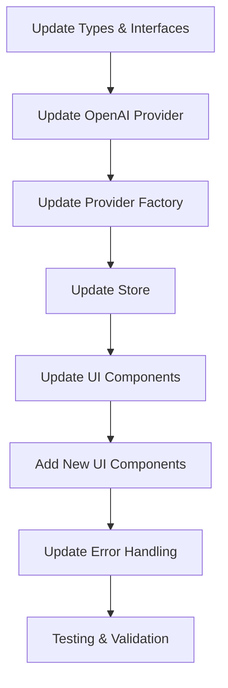
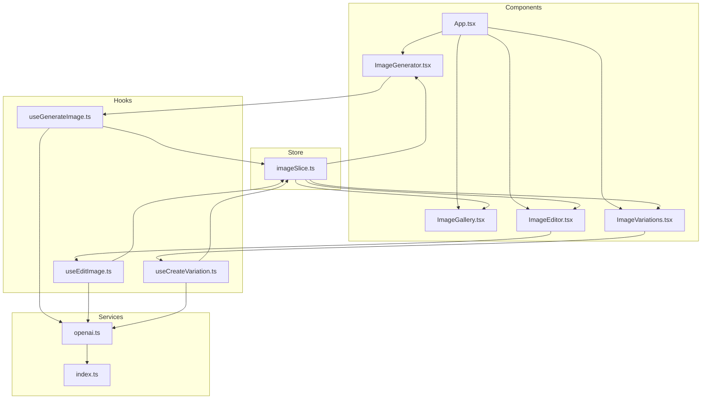
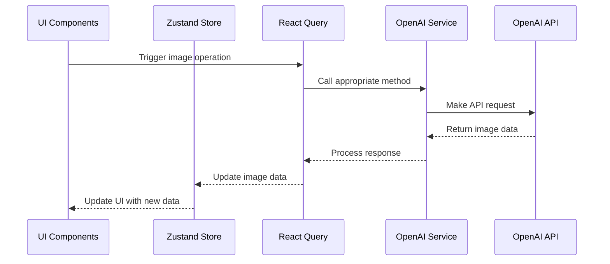

# GPT Image Model Implementation Plan

## 1. Overview

This document outlines the implementation plan for enhancing the image generator application with OpenAI's GPT Image model support. The plan includes completely replacing DALL-E 3, creating separate UI components for editing images, implementing a dedicated Variations page, showing all new parameters by default, and implementing detailed error handling.

## 2. Detailed Implementation Steps

### 2.1 Update Types & Interfaces

First, we need to update the type definitions to support the new GPT Image model capabilities:

1. Update `GenerateImageOptions` interface in `src/types/index.ts`:
   - Add `quality` parameter (hd/standard)
   - Add `format` parameter (png, jpeg, webp)
   - Add `transparency` parameter (boolean)
   - Update `size` options to match GPT Image model supported sizes

2. Add new interfaces for image editing and variations:
   - Add `EditImageOptions` interface
   - Add `CreateVariationOptions` interface

3. Update `GeneratedImage` interface to include additional metadata:
   - Add `quality` field
   - Add `format` field
   - Add `transparency` field
   - Add `model` field to track which model generated the image

4. Update `ImageGenerationProvider` interface to include new methods:
   - Add `editImage` method
   - Add `createVariation` method
   - Update `getSupportedSizes` to reflect GPT Image model sizes
   - Add `getSupportedQualities` method
   - Add `getSupportedFormats` method

### 2.2 Update OpenAI Provider

Next, we need to update the OpenAI provider to use the GPT Image model and implement the new capabilities:

1. Update `OpenAIProvider` class in `src/services/imageGeneration/openai.ts`:
   - Update `SUPPORTED_SIZES` constant
   - Add `SUPPORTED_QUALITIES` constant
   - Add `SUPPORTED_FORMATS` constant
   - Update `generateImage` method to use GPT Image model
   - Implement `editImage` method
   - Implement `createVariation` method
   - Update error handling for model-specific errors

2. Update the provider to handle the new parameters:
   - Handle `quality` parameter
   - Handle `format` parameter
   - Handle `transparency` parameter

### 2.3 Update Provider Factory

Update the provider factory to handle the updated provider:

1. Update `getImageProvider` function in `src/services/imageGeneration/index.ts`:
   - Remove DALL-E 3 specific code
   - Update to use GPT Image model by default

### 2.4 Update Store

Update the store to handle the new image metadata and actions:

1. Update `ImageSlice` interface in `src/store/slices/imageSlice.ts`:
   - Add new state fields for edited images and variations
   - Add new actions for editing images and creating variations

2. Update `createImageSlice` function:
   - Implement new actions for editing images and creating variations
   - Update existing actions to handle new metadata

### 2.5 Update UI Components

Update existing UI components to support the new parameters:

1. Update `ImageGenerator` component in `src/components/ImageGenerator/index.tsx`:
   - Add UI controls for quality selection
   - Add UI controls for format selection
   - Add UI controls for transparency toggle
   - Update form submission to include new parameters

2. Update `ImageGallery` component in `src/components/ImageGallery/index.tsx`:
   - Update card display to show new metadata
   - Add navigation links to Edit and Variations pages

### 2.6 Add New UI Components

Create new UI components for image editing and variations:

1. Create `ImageEditor` component:
   - Implement UI for editing existing images
   - Add controls for editing parameters
   - Implement form submission for editing

2. Create `ImageVariations` component:
   - Implement UI for creating variations of existing images
   - Add controls for variation parameters
   - Implement form submission for creating variations

3. Create new pages for these components:
   - Create `EditPage` component
   - Create `VariationsPage` component

4. Update routing to include new pages

### 2.7 Update Error Handling

Implement detailed error handling for model-specific errors:

1. Create error mapping for GPT Image model errors
2. Update error display in UI components
3. Add specific error messages for each error type
4. Implement error logging for debugging

### 2.8 Testing & Validation

Implement testing and validation for the new features:

1. Test image generation with new parameters
2. Test image editing functionality
3. Test variations functionality
4. Test error handling for various scenarios

## 3. Component Relationship Diagram

## 4. Data Flow Diagram

## 5. File Modifications

Here's a detailed list of files that need to be modified:

1. `src/types/index.ts` - Update interfaces and types
2. `src/services/imageGeneration/openai.ts` - Update provider implementation
3. `src/services/imageGeneration/index.ts` - Update provider factory
4. `src/store/slices/imageSlice.ts` - Update store slice
5. `src/components/ImageGenerator/index.tsx` - Update UI for new parameters
6. `src/components/ImageGallery/index.tsx` - Add navigation to new pages
7. `src/hooks/queries/useGenerateImage.ts` - Update hook for new parameters

New files to be created:

1. `src/components/ImageEditor/index.tsx` - New component for editing images
2. `src/components/ImageVariations/index.tsx` - New component for creating variations
3. `src/hooks/queries/useEditImage.ts` - New hook for image editing
4. `src/hooks/queries/useCreateVariation.ts` - New hook for creating variations
5. `src/pages/edit.tsx` - New page for image editing
6. `src/pages/variations.tsx` - New page for image variations
7. `src/utils/errorMapping.ts` - Error mapping for model-specific errors

## 6. Implementation Timeline

1. **Phase 1: Core Updates (Day 1)**
   - Update types and interfaces
   - Update OpenAI provider
   - Update provider factory

2. **Phase 2: Store and Hooks (Day 2)**
   - Update store slice
   - Update existing hooks
   - Create new hooks

3. **Phase 3: UI Components (Day 3-4)**
   - Update existing UI components
   - Create new UI components
   - Create new pages

4. **Phase 4: Error Handling and Testing (Day 5)**
   - Implement detailed error handling
   - Test all functionality
   - Fix any issues