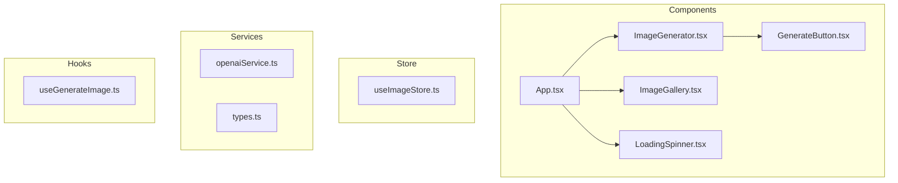
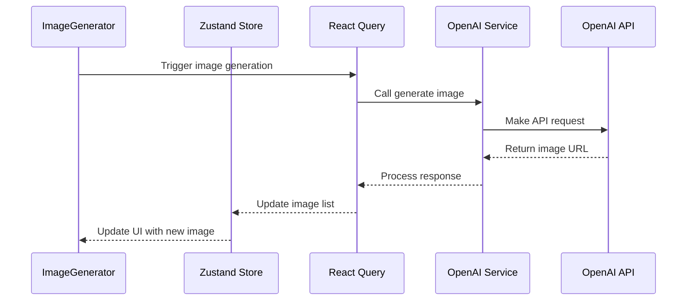

# Image Generator Application Architecture

## Overview
This document outlines the architecture for a React-based image generation application using OpenAI's image model. The application follows modern React practices and utilizes a carefully selected stack of libraries for optimal performance and developer experience. The architecture is designed to be highly extensible and adaptable for diverse site types without requiring drastic alterations.

## Scalability and Extensibility Considerations

### Key Architectural Principles
1. **Modular Design**: Components, services, and hooks are designed as independent modules that can be easily replaced or extended
2. **Separation of Concerns**: Clear boundaries between UI, state management, and API services
3. **Pluggable Services**: Service layer designed to support multiple AI providers beyond just OpenAI
4. **Configurable Components**: UI components accept configuration options to adapt to different use cases
5. **Progressive Enhancement**: Core functionality works with minimal dependencies, with optional advanced features

### Scalability Considerations
- **Performance Optimization**: Strategies for handling large image collections
- **Server-Side Rendering Support**: Architecture compatible with SSR for improved performance
- **Caching Strategy**: Multi-level caching for API responses and generated images
- **Lazy Loading**: Components and routes load on demand to minimize initial bundle size

## Tech Stack & Best Practices

### Core Technologies
- **React 18+**
  - Use functional components and hooks
  - Implement proper error boundaries
  - Utilize React.Suspense for loading states
  - Follow the [React Beta docs](https://beta.reactjs.org/) guidelines for best practices

- **Zustand (State Management)**
  - Keep stores small and focused
  - Use separate stores for different domains
  - Implement proper TypeScript types
  - Utilize built-in devtools during development
  - Prefer colocating actions with state for better maintainability
  - Use shallow equality for optimized rendering
  - **Extensibility Enhancements**:
    - Implement store slices pattern for modular state management
    - Use middleware for cross-cutting concerns (persistence, logging)
    - Create store factories for reusable state patterns
  ```typescript
  // Example store structure
  import { create } from 'zustand'
  import { devtools } from 'zustand/middleware'
  import { shallow } from 'zustand/shallow'

  interface GeneratedImage {
    id: string;
    url: string;
    prompt: string;
    createdAt: Date;
  }

  interface ImageStore {
    // State
    images: GeneratedImage[];
    isGenerating: boolean;
    error: string | null;
    
    // Actions
    addImage: (image: GeneratedImage) => void;
    setGenerating: (status: boolean) => void;
    setError: (error: string | null) => void;
    clearImages: () => void;
  }

  export const useImageStore = create<ImageStore>()(
    devtools(
      (set, get, api) => ({
        // Initial state
        images: [],
        isGenerating: false,
        error: null,
        
        // Actions
        addImage: (image) =>
          set((state) => ({
            images: [image, ...state.images],
            error: null
          })),
        setGenerating: (status) =>
          set({ isGenerating: status }),
        setError: (error) =>
          set({ error, isGenerating: false }),
        clearImages: () =>
          set({ images: [] })
      }),
      { name: 'image-store' }
    )
  )

  // Usage in component with optimized rendering
  const { images, isGenerating } = useImageStore(
    (state) => ({
      images: state.images,
      isGenerating: state.isGenerating
    }),
    shallow
  )
  ```

- **@tanstack/react-query**
  - Implement proper query keys that include all dependencies
  - Use proper cache invalidation strategies
  - Handle loading and error states consistently
  - Utilize built-in devtools during development
  - Memoize selector functions with useCallback
  - Implement proper error handling and retry logic
  - **Extensibility Enhancements**:
    - Implement query key factories for consistent key generation
    - Create custom hooks for common data fetching patterns
    - Use React Query's prefetching capabilities for improved UX
    - Implement infinite queries for handling large datasets
    - Set up query filters for flexible data retrieval
  ```typescript
  // Example query hook
  import { useMutation, useQueryClient } from '@tanstack/react-query';
  import { useImageStore } from '../store/useImageStore';

  interface GenerateImageParams {
    prompt: string;
    size?: '256x256' | '512x512' | '1024x1024';
  }

  export const useGenerateImage = () => {
    const queryClient = useQueryClient();
    const config = useAppConfig();
    const provider = useMemo(() => getImageProvider(config), [config]);
    
    // Get store actions with useCallback to prevent unnecessary re-renders
    const addImage = useCallback(useImageStore.getState().addImage, []);
    const setGenerating = useCallback(useImageStore.getState().setGenerating, []);
    const setError = useCallback(useImageStore.getState().setError, []);

    return useMutation({
      mutationKey: ['generateImage'],
      mutationFn: async ({ prompt, size = '1024x1024' }: GenerateImageParams) => {
        const response = await fetch('/api/generate-image', {
          method: 'POST',
          headers: { 'Content-Type': 'application/json' },
          body: JSON.stringify({ prompt, size }),
        });

        if (!response.ok) {
          const error = await response.json();
          throw new Error(error.message || 'Failed to generate image');
        }

        return await response.json();
      },
      onMutate: () => {
        setGenerating(true);
        setError(null);
        // Return a cleanup function for rollback if needed
        return () => {
          setGenerating(false);
          setError(null);
        };
      },
      onSuccess: (data) => {
        addImage({
          id: data.id,
          url: data.url,
          prompt: data.prompt,
          createdAt: new Date()
        });
        queryClient.invalidateQueries({ queryKey: ['images'] });
      },
      onError: (error: Error) => {
        setError(error.message);
      },
      onSettled: (_, error, _variables, rollback) => {
        if (error && rollback) {
          // Use rollback function from onMutate if available
          rollback();
        } else {
          setGenerating(false);
        }
      },
      retry: 1,
      retryDelay: 1000,
    });
  };
  ```

- **Mantine UI**
  - Follow Mantine's theming system
  - Utilize built-in hooks for responsive design
  - Implement proper color scheme handling
  - Use Mantine's grid system for layouts
  - Add 'use client' directive at the top of files using Mantine components
  - Ensure proper accessibility with closeButtonLabel for alerts
  - Use TextInput instead of Input for better accessibility
  - Leverage Mantine's responsive utilities like useMatches
  - **Extensibility Enhancements**:
    - Create component composition patterns for flexible UI building blocks
    - Implement theme extension points for customization
    - Build a design system abstraction layer for potential UI library changes
    - Use compound components pattern for complex UI elements
    - Create adapter components to isolate UI library dependencies
  ```tsx
  // Example component with Mantine UI
  'use client';
  
  import { useState } from 'react';
  import {
    TextInput,
    Button,
    Stack,
    Group,
    Paper,
    Title,
    Text,
    Alert,
    LoadingOverlay,
    Image
  } from '@mantine/core';
  import { useGenerateImage } from '../hooks/useGenerateImage';
  import { useImageStore } from '../store/useImageStore';
  import { shallow } from 'zustand/shallow';

  export function ImageGenerator() {
    const [prompt, setPrompt] = useState('');
    const { mutate, isPending } = useGenerateImage();
    // Use separate selectors to minimize re-renders and prevent infinite loops
    const isGenerating = useImageStore(state => state.isGenerating);
    const error = useImageStore(state => state.error);
    const setError = useImageStore(state => state.setError);

    const handleSubmit = (e: React.FormEvent) => {
      e.preventDefault();
      if (prompt.trim()) {
        mutate({ prompt });
      }
    };

    return (
      <Paper p="md" radius="md" withBorder>
        <Title order={2} mb="md">Generate Image</Title>
        
        <form onSubmit={handleSubmit}>
          <Stack>
            {error && (
              <Alert
                color="red"
                title="Error"
                withCloseButton
                closeButtonLabel="Dismiss"
                onClose={() => setError(null)}
              >
                {error}
              </Alert>
            )}
            
            <TextInput
              label="Image Description"
              description="Describe the image you want to generate"
              placeholder="A cyberpunk city with neon lights and flying cars"
              value={prompt}
              onChange={(e) => setPrompt(e.currentTarget.value)}
              required
              disabled={isGenerating}
            />
            
            <Group justify="flex-end">
              <Button
                type="submit"
                loading={isGenerating}
                disabled={!prompt.trim()}
              >
                Generate
              </Button>
            </Group>
          </Stack>
        </form>
        
        <div style={{ position: 'relative', minHeight: '200px', marginTop: '1rem' }}>
          <LoadingOverlay visible={isPending || isGenerating} />
        </div>
      </Paper>
    );
  }
  ```

### Architecture Diagrams

#### Component Structure


#### Data Flow


## Project Structure
```
src/
├── components/
│   ├── ImageGenerator/
│   │   ├── index.tsx
│   │   └── styles.ts
│   ├── ImageGallery/
│   │   ├── index.tsx
│   │   └── styles.ts
│   ├── ImageCard/
│   │   ├── index.tsx
│   │   └── styles.ts
│   ├── common/
│   │   ├── ErrorAlert/
│   │   │   └── index.tsx
│   │   ├── LoadingSpinner/
│   │   │   └── index.tsx
│   │   └── EmptyState/
│   │       └── index.tsx
│   └── ui/ # Adapter components for UI library
│       ├── Button/
│       │   └── index.tsx
│       ├── Input/
│       │   └── index.tsx
│       └── Card/
│           └── index.tsx
├── store/
│   ├── slices/ # Modular store slices
│   │   ├── imageSlice.ts
│   │   └── uiSlice.ts
│   ├── middleware/ # Store middleware
│   │   ├── logger.ts
│   │   └── persistence.ts
│   └── index.ts # Store composition
├── services/
│   ├── api/ # API client abstraction
│   │   ├── client.ts
│   │   └── endpoints.ts
│   ├── imageGeneration/ # Pluggable image generation services
│   │   ├── openai.ts
│   │   ├── stabilityAi.ts # Future alternative provider
│   │   └── index.ts # Provider factory
│   └── types.ts
├── hooks/
│   ├── queries/ # React Query hooks
│   │   ├── useGenerateImage.ts
│   │   └── useImageHistory.ts
│   └── ui/ # UI-related hooks
│       ├── useImageUpload.ts
│       └── useResponsive.ts
├── utils/
│   ├── constants.ts
│   ├── formatters.ts
│   ├── validators.ts
│   └── queryKeys.ts # Centralized query key management
├── pages/
│   ├── index.tsx
│   ├── history.tsx
│   └── settings.tsx # Configuration page
├── styles/
│   ├── theme.ts
│   └── global.css
├── types/
│   ├── index.ts
│   ├── api.ts
│   └── config.ts # Configuration types
├── config/ # Application configuration
│   ├── features.ts # Feature flags
│   └── providers.ts # Service provider configuration
└── App.tsx
```

## Implementation Guidelines

### Error Handling
1. Implement proper error boundaries at component level
2. Use React Query's error handling capabilities
3. Display user-friendly error messages using Mantine's notification system
4. Log errors appropriately for debugging

### Performance Considerations
1. Implement proper image loading strategies
2. Use React Query's caching capabilities
3. Implement proper loading states
4. Consider implementing virtual scrolling for large image galleries

### Security Considerations
1. Store API keys in environment variables
2. Implement proper rate limiting
3. Validate user inputs
4. Handle API errors gracefully

### OpenAI Integration
1. Implement proper error handling for API limits
2. Cache successful responses
3. Implement retry logic for failed requests
4. Handle rate limiting gracefully
5. Store API keys in environment variables
6. Implement proper validation for user inputs
7. Use appropriate image sizes to optimize cost and quality
8. Handle and display generation errors to users

### Provider Abstraction Layer
To ensure the application can work with multiple image generation providers:

1. **Common Interface**: Define a standard interface for image generation services
2. **Provider Factory**: Create a factory pattern to instantiate the appropriate provider
3. **Configuration-Driven**: Use configuration to determine which provider to use
4. **Feature Detection**: Adapt UI based on provider capabilities
5. **Fallback Mechanism**: Implement fallback to alternative providers when primary is unavailable

```typescript
// Example provider interface
export interface ImageGenerationProvider {
  generateImage(options: GenerateImageOptions): Promise<GeneratedImage>;
  getSupportedSizes(): string[];
  getSupportedFormats(): string[];
  getMaxImagesPerRequest(): number;
}

// Provider factory
export function getImageProvider(config: AppConfig): ImageGenerationProvider {
  switch (config.imageProvider) {
    case 'openai':
      return new OpenAIProvider(config.openai);
    case 'stabilityai':
      return new StabilityAIProvider(config.stabilityai);
    default:
      return new OpenAIProvider(config.openai);
  }
}

// Usage in hooks
export const useGenerateImage = () => {
  const config = useAppConfig();
  const provider = useMemo(() => getImageProvider(config), [config]);
  
  // Rest of the hook implementation using the provider
  // ...
}
```

```typescript
// Example OpenAI service implementation
import { OpenAI } from 'openai';

// Initialize the OpenAI client with API key from environment variables
const openai = new OpenAI({
  apiKey: process.env.OPENAI_API_KEY,
});

export interface GenerateImageOptions {
  prompt: string;
  size?: '256x256' | '512x512' | '1024x1024';
  n?: number;
}

export async function generateImage({
  prompt,
  size = '1024x1024',
  n = 1
}: GenerateImageOptions) {
  try {
    // Validate inputs
    if (!prompt || prompt.length < 3) {
      throw new Error('Prompt must be at least 3 characters long');
    }
    
    // Call OpenAI API
    const response = await openai.images.generate({
      model: "dall-e-3",
      prompt,
      n,
      size,
      response_format: "url",
    });

    // Return the generated image data
    return {
      id: response.created,
      url: response.data[0].url,
      prompt,
      revised_prompt: response.data[0].revised_prompt
    };
  } catch (error: any) {
    // Handle different types of errors
    if (error.response) {
      // OpenAI API error
      const status = error.response.status;
      const data = error.response.data;
      
      if (status === 429) {
        throw new Error('Rate limit exceeded. Please try again later.');
      } else if (status === 400) {
        throw new Error(data.error.message || 'Invalid request parameters');
      } else {
        throw new Error(`OpenAI API error: ${data.error.message}`);
      }
    } else {
      // Network or other error
      throw new Error(`Error generating image: ${error.message}`);
    }
  }
}
```

## Development Workflow
1. Use TypeScript for type safety
2. Implement proper testing using React Testing Library
3. Use ESLint and Prettier for code formatting
4. Follow Git commit conventions

## React StrictMode Considerations

React's StrictMode is a development mode feature that helps identify potential problems in an application by intentionally double-invoking functions like component render methods, useState setters, and effects. While this is valuable for catching bugs, it can cause issues with certain patterns, especially with state management libraries like Zustand.

### Potential Issues with StrictMode

1. **Double Rendering**: Components render twice in development, which can cause issues if not handled properly
2. **State Updates**: State updates may be called twice, potentially causing unexpected behavior
3. **Effect Cleanup**: Effects run, clean up, and run again, which can cause issues with subscriptions or API calls

### Best Practices for StrictMode Compatibility

1. **Proper Store Implementation**:
   - Ensure store initialization is idempotent
   - Use proper memoization for selectors
   - Implement proper cleanup for side effects

2. **Component Design**:
   - Avoid direct store access in render functions
   - Use separate selectors for different pieces of state
   - Implement proper cleanup for effects

3. **Debugging Strategies**:
   - Temporarily disable StrictMode during debugging if necessary
   - Use React DevTools to identify unnecessary re-renders
   - Implement proper logging to track state changes

4. **Testing**:
   - Test components with StrictMode enabled
   - Verify behavior in both development and production modes
   - Use React Testing Library to simulate user interactions

### Example StrictMode Configuration

```tsx
// src/main.tsx
import React from 'react';
import ReactDOM from 'react-dom/client';
import App from './App';

ReactDOM.createRoot(document.getElementById('root')!).render(
  <React.StrictMode>
    <App />
  </React.StrictMode>
);
```

## Getting Started
1. Install dependencies
2. Set up environment variables
3. Initialize the development server
4. Set up linting and formatting tools

## Next Steps
1. Set up project with Vite or Next.js
2. Configure Mantine UI with theme
3. Implement state management with Zustand
4. Create API service layer with provider abstraction
5. Develop core UI components
   - ImageGenerator form
   - ImageGallery display
   - ImageCard component
   - Error and loading states
6. Implement React Query for API calls
7. Add responsive design for mobile and desktop
8. Implement error handling and validation
9. Add image history and persistence
10. Set up unit and integration testing
11. Implement configuration system and feature flags
12. Create adapter components for UI library abstraction
13. Optimize performance and accessibility
14. Deploy to hosting platform

## Potential Bottlenecks and Mitigation Strategies

### Performance Bottlenecks
1. **Large Image Collections**
   - Implement virtualized lists for efficient rendering
   - Use image lazy loading and progressive loading
   - Implement pagination or infinite scrolling

2. **API Rate Limits**
   - Implement request queuing and batching
   - Add local caching of responses
   - Provide feedback to users about rate limits

3. **Bundle Size**
   - Use code splitting and lazy loading
   - Implement tree-shaking for unused components
   - Optimize dependencies with module/nomodule pattern

### Extensibility Challenges
1. **Adding New Providers**
   - Use adapter pattern for new service integrations
   - Implement feature detection for provider capabilities
   - Create clear documentation for adding new providers

2. **UI Customization**
   - Use theme tokens instead of hard-coded values
   - Implement component composition for flexible layouts
   - Create extension points for custom components

3. **State Management Complexity**
   - Use store slices for domain separation
   - Implement middleware for cross-cutting concerns
   - Create selectors for derived state


## Implementation Challenges and Solutions

During the implementation of this architecture, several challenges were encountered and addressed:

### Zustand and React Integration Issues

1. **Infinite Loop with Store Access**
   - **Problem**: Directly accessing the store with `useStore.getState()` inside component render functions or event handlers can cause infinite loops, especially with React's StrictMode enabled.
   - **Solution**:
     - Use proper hooks-based selectors to access store state
     - Extract store actions into callbacks or component-level functions
     - Avoid direct store access in render functions or inline event handlers
   - **Example Fix**:
   ```tsx
   // Problematic pattern (causes infinite loops)
   <Alert onClose={() => useStore.getState().setError(null)} />
   
   // Correct pattern
   const setError = useStore((state) => state.setError);
   <Alert onClose={() => setError(null)} />
   ```

2. **State Synchronization with React Query**
   - **Problem**: Improper synchronization between React Query mutation state and Zustand store state can lead to race conditions and UI inconsistencies.
   - **Solution**:
     - Use callbacks for store actions in mutation hooks
     - Implement proper cleanup in onSettled callbacks
     - Ensure state transitions are handled consistently
   - **Example Fix**:
   ```tsx
   // Improved mutation hook with proper state handling
   export function useGenerateImage() {
     const addImage = useCallback(useStore.getState().addImage, []);
     const setGenerating = useCallback(useStore.getState().setGenerating, []);
     const setError = useCallback(useStore.getState().setError, []);
     
     return useMutation({
       // ...mutation configuration
       onMutate: () => {
         setGenerating(true);
         setError(null);
       },
       onSettled: () => {
         setGenerating(false);
       },
     });
   }
   ```

3. **React StrictMode Compatibility**
   - **Problem**: React's StrictMode causes components to render twice in development, which can exacerbate state management issues.
   - **Solution**:
     - Ensure store implementation is compatible with double rendering
     - Use proper memoization for selectors and callbacks
     - Implement store with proper state initialization
     - Consider temporarily disabling StrictMode during debugging

4. **Selector Optimization**
   - **Problem**: Inefficient selectors can cause unnecessary re-renders and performance issues.
   - **Solution**:
     - Use separate selectors for different pieces of state
     - Implement proper equality functions for complex state
     - Use memoization for derived state
   - **Example Fix**:
   ```tsx
   // Inefficient selector (may cause unnecessary re-renders)
   const { images, isGenerating, error } = useStore(state => ({
     images: state.images,
     isGenerating: state.isGenerating,
     error: state.error
   }));
   
   // Optimized selectors
   const images = useStore(state => state.images);
   const isGenerating = useStore(state => state.isGenerating);
   const error = useStore(state => state.error);
   ```

## React StrictMode Considerations

React's StrictMode is a development mode feature that helps identify potential problems in an application by intentionally double-invoking functions like component render methods, useState setters, and effects. While this is valuable for catching bugs, it can cause issues with certain patterns, especially with state management libraries like Zustand.

### Potential Issues with StrictMode

1. **Double Rendering**: Components render twice in development, which can cause issues if not handled properly
2. **State Updates**: State updates may be called twice, potentially causing unexpected behavior
3. **Effect Cleanup**: Effects run, clean up, and run again, which can cause issues with subscriptions or API calls

### Best Practices for StrictMode Compatibility

1. **Proper Store Implementation**:
  - Ensure store initialization is idempotent
  - Use proper memoization for selectors
  - Implement proper cleanup for side effects

2. **Component Design**:
  - Avoid direct store access in render functions
  - Use separate selectors for different pieces of state
  - Implement proper cleanup for effects

3. **Debugging Strategies**:
  - Temporarily disable StrictMode during debugging if necessary
  - Use React DevTools to identify unnecessary re-renders
  - Implement proper logging to track state changes

4. **Testing**:
  - Test components with StrictMode enabled
  - Verify behavior in both development and production modes
  - Use React Testing Library to simulate user interactions

### Example StrictMode Configuration

```tsx
// src/main.tsx
import React from 'react';
import ReactDOM from 'react-dom/client';
import App from './App';

ReactDOM.createRoot(document.getElementById('root')!).render(
 <React.StrictMode>
   <App />
 </React.StrictMode>
);
```

## Common Pitfalls and Best Practices

### Zustand and React Integration

1. **Avoid Direct Store Access in Render**
   - **Problem**: Using `useStore.getState()` directly in render or event handlers can cause infinite loops
   - **Solution**: Always use the hook form `useStore(selector)` in components

2. **Selector Optimization**
   - **Problem**: Inefficient selectors can cause unnecessary re-renders
   - **Solution**: Select only what you need, use separate selectors for different pieces of state

3. **Store Updates During Render**
   - **Problem**: Updating store state during render can cause infinite loops
   - **Solution**: Move state updates to event handlers or effects

4. **Middleware Considerations**
   - **Problem**: Some middleware can interfere with React's rendering cycle
   - **Solution**: Ensure middleware is compatible with React's rendering model

### React Query and Zustand Integration

1. **State Synchronization**
   - **Problem**: Keeping React Query state and Zustand store in sync can be challenging
   - **Solution**: Use mutation callbacks to update store state

2. **Error Handling**
   - **Problem**: Error states can be inconsistent between React Query and Zustand
   - **Solution**: Implement consistent error handling in mutation callbacks

3. **Loading States**
   - **Problem**: Multiple loading indicators can lead to UI inconsistencies
   - **Solution**: Consolidate loading states or use a hierarchy of loading indicators

4. **Cache Invalidation**
   - **Problem**: Improper cache invalidation can lead to stale data
   - **Solution**: Use proper query keys and invalidation strategies

### Performance Optimization

1. **Memoization**
   - **Problem**: Unnecessary re-renders can impact performance
   - **Solution**: Use memoization for expensive computations and callbacks

2. **Batched Updates**
   - **Problem**: Multiple state updates can cause multiple re-renders
   - **Solution**: Batch related state updates when possible

3. **Selective Rendering**
   - **Problem**: Large components re-rendering can cause performance issues
   - **Solution**: Break down components and use selective rendering

## Long-term Maintenance Considerations
1. **Dependency Management**
   - Regular updates of dependencies
   - Automated vulnerability scanning
   - Comprehensive integration tests

2. **Documentation**
   - Maintain architecture diagrams
   - Document extension points and customization options
   - Create examples for common customization scenarios

3. **Monitoring and Analytics**
   - Implement error tracking
   - Add performance monitoring
   - Track usage patterns for optimization

## Implementation Timeline

1. **Week 1: Foundation and Core Architecture**
   - **Day 1-2: Project Setup and Structure**
     - Initialize project with build tools
     - Set up Mantine UI with theme system
     - Create basic project structure with extensibility in mind
     - Implement configuration system
   
   - **Day 3-4: State Management and Service Layer**
     - Implement Zustand store with slice pattern
     - Create provider abstraction layer
     - Set up OpenAI integration
     - Implement persistence middleware

   - **Day 5: UI Component Foundation**
     - Build adapter components for UI library
     - Create base components with composition patterns
     - Implement responsive utilities

2. **Week 2: Feature Implementation and Refinement**
   - **Day 1-2: Core Features**
     - Implement ImageGenerator component
     - Create ImageGallery with virtualization
     - Build ImageCard component
     - Add React Query hooks for data fetching

   - **Day 3-4: Advanced Features**
     - Implement image history and persistence
     - Add settings and configuration UI
     - Create alternative provider implementation
     - Implement feature flags

   - **Day 5: Testing and Documentation**
     - Write unit tests for core functionality
     - Create integration tests for key user flows
     - Document extension points and customization options

3. **Week 3: Optimization and Deployment**
   - **Day 1-2: Performance Optimization**
     - Implement code splitting and lazy loading
     - Optimize bundle size
     - Add caching strategies
     - Implement performance monitoring

   - **Day 3-4: Accessibility and Polish**
     - Conduct accessibility audit
     - Implement keyboard navigation
     - Add screen reader support
     - Polish animations and transitions

   - **Day 5: Deployment and CI/CD**
     - Set up CI/CD pipeline
     - Configure deployment environments
     - Implement monitoring and error tracking
     - Prepare documentation for users