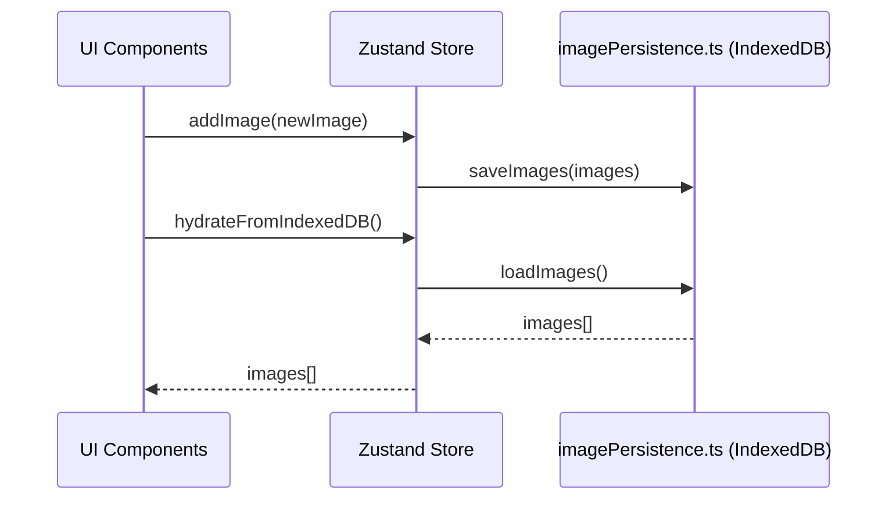

# Image Persistence Implementation

## 1. Introduction

### Problem Statement
Originally, generated images in the application were stored only in memory using Zustand. This meant that all images were lost whenever the user refreshed the page or closed the browser tab, resulting in a poor user experience and loss of creative work.

### Solution Overview
To address this, we implemented IndexedDB-based persistence. This ensures that all generated images, as well as edited images and variations, are retained across browser sessions, providing a robust and reliable user experience.

---

## 2. Architecture & Design Decisions

### Why IndexedDB?
- **localStorage**: Not suitable for large binary/image data due to size and synchronous API limitations.
- **File System Access API**: Not widely supported across browsers.
- **IndexedDB**: Asynchronous, supports large data, and is well-supported in all major browsers. Chosen as the optimal solution for client-side image persistence.

### Store Structure
- **Object Stores**:  
  - `images`  
  - `edited-images`  
  - `variations`  
- Each store uses `id` as the key for efficient retrieval and management.

### Integration Approach
- **Persistence Utility**: All IndexedDB operations are abstracted in a utility module.
- **Zustand Image Slice**: Calls persistence methods on add, clear, and hydrate actions.
- **Store Initialization**: Hydrates from IndexedDB automatically on startup.

---

## 3. Implementation Overview

### Persistence Utility ([`src/utils/imagePersistence.ts`](src/utils/imagePersistence.ts:1))
- `initializeDB`: Sets up the database and object stores.
- `saveImages`: Saves an array of images to the specified store.
- `loadImages`: Loads all images from a store, deserializing dates.
- `clearImages`: Clears all images from a store.
- `clearAllData`: Clears all object stores.
- **Logging**: Diagnostic logs for all major operations.

### Image Slice ([`src/store/slices/imageSlice.ts`](src/store/slices/imageSlice.ts:1))
- **State**:  
  - `images`, `editedImages`, `variations`
  - `operationState` (includes `isHydrating`, error, and operation flags)
- **Actions**:  
  - Add, clear, hydrate, and error handling
  - All state changes are persisted to IndexedDB

### Store Initialization ([`src/store/index.ts`](src/store/index.ts:1))
- IndexedDB is initialized on module load.
- Hydration from IndexedDB is triggered automatically on store creation.

### Component Usage
- **Gallery**: Shows a loader during hydration and displays images from the store.
- **Generator**: Triggers image creation, which is persisted via store actions.
- **Transparency**: All persistence is handled behind the scenes; component authors interact with the store as usual.

---

## 4. Developer Usage Examples

### Adding an Image
```ts
useStore.getState().addImage(newImage);
```

### Clearing Images
```ts
useStore.getState().clearImages();
```

### Hydrating from IndexedDB (manual trigger, if needed)
```ts
await useStore.getState().hydrateFromIndexedDB();
```

### Component Example: Gallery Loading State
```tsx
const isHydrating = useStore((state) => state.operationState.isHydrating);
if (isHydrating) {
  return <Loader />;
}
```

---

## 5. Data Flow & Diagrams

### a. Data Flow Diagram



### b. Architecture Diagram

```mermaid
graph TD
    A[UI Components] --> B[Zustand Store (Image Slice)]
    B --> C[imagePersistence.ts]
    C --> D[IndexedDB]
```

---

## 6. Limitations & Future Improvements

### Current Limitations
- Only works in browsers with IndexedDB support (most modern browsers; not available in some embedded browsers or privacy modes).
- No cross-device or cloud sync; persistence is local to the user's browser.
- No version migration for object stores; future schema changes may require migration logic.

### Future Improvements
- Add support for image editing and variations (planned).
- Implement more granular error handling and user feedback.
- Consider export/import or cloud sync options for portability.

---

## 7. References

- [`src/utils/imagePersistence.ts`](src/utils/imagePersistence.ts:1)
- [`src/store/slices/imageSlice.ts`](src/store/slices/imageSlice.ts:1)
- [`src/store/index.ts`](src/store/index.ts:1)
- [`src/components/ImageGallery/index.tsx`](src/components/ImageGallery/index.tsx:1)
- [`src/components/ImageGenerator/index.tsx`](src/components/ImageGenerator/index.tsx:1)
- [`src/hooks/queries/useGenerateImage.ts`](src/hooks/queries/useGenerateImage.ts:1)